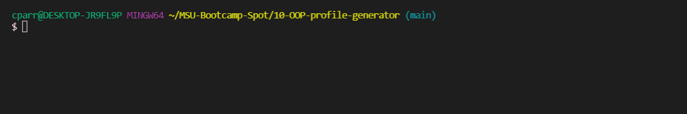
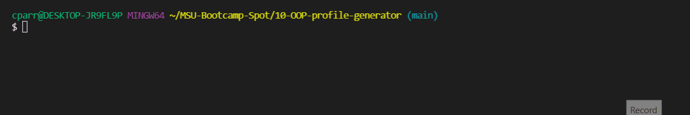

# 10-OOP-profile-generator

## User Story

```md
AS A manager
I WANT to generate a webpage that displays my team's basic info
SO THAT I have quick access to their emails and GitHub profiles
```

## Functionality

```md
Run node index.js to initiate team creation
```

## Node index.js

The following gif shows an example of running node index to launch the team creation questions and functionality:



## Running tests

The following gif shows an example of running tests, enter "npm run test" to initiate

